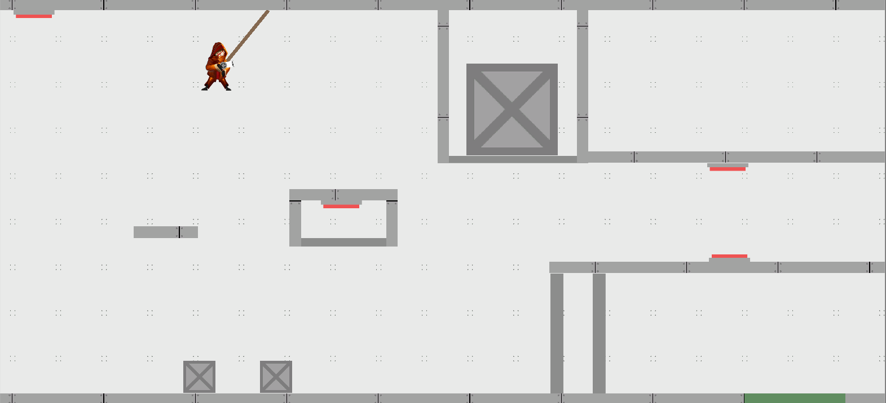
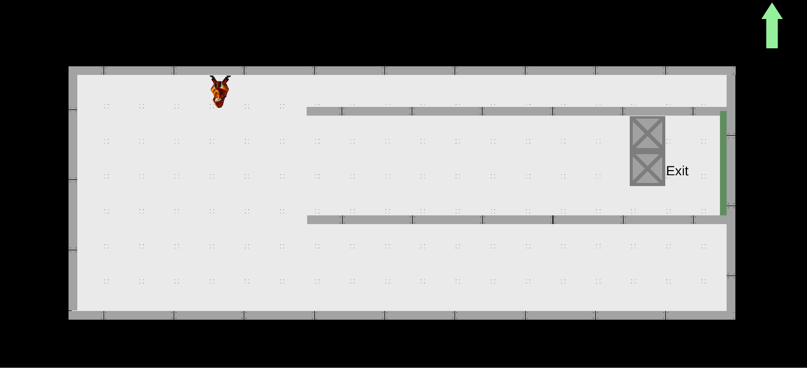
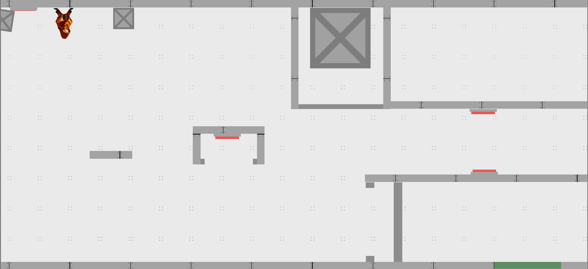
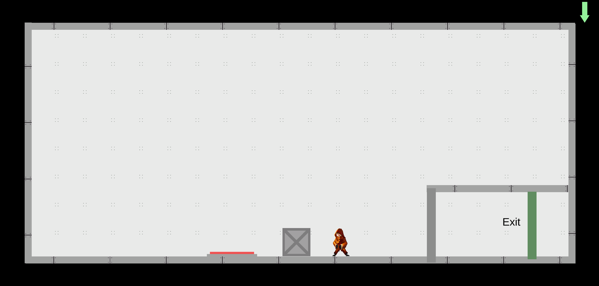

# Samurai Shift
A samurai in space puzzle platformer

# Group Members
- Matthew Paseltiner - Group Lead/Puzzle Design
- Max De George - Art & Animation
- Katie Roy - Level/Puzzle Design
- Dan Singer - Programming(Gravity, Camera, Player movement), SFX/Music
- Michael Capra - Programming(Grappling Hook, Camera)
- TJ Wolschon - Programming(Buttons, Doors, Scene Transitions, Animation)

# Screenshots

# Gameplay video by Dan Singer

Click to play

